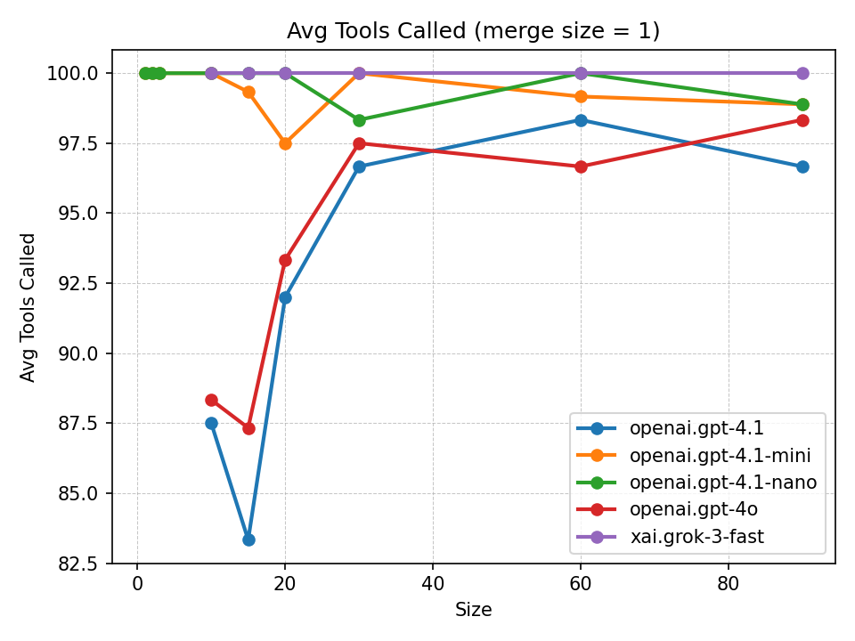
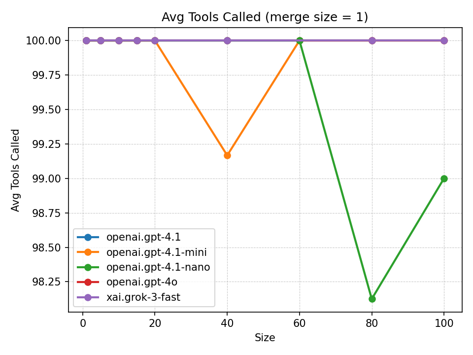
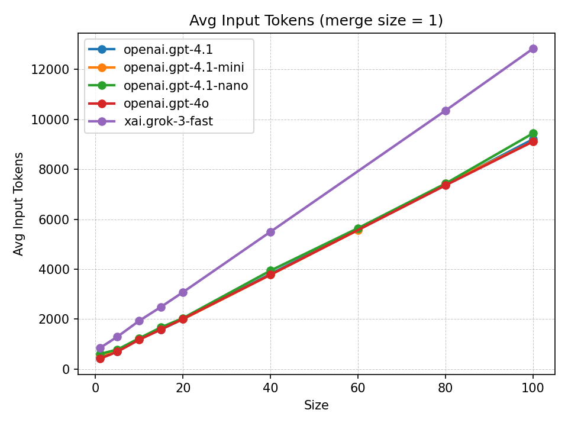
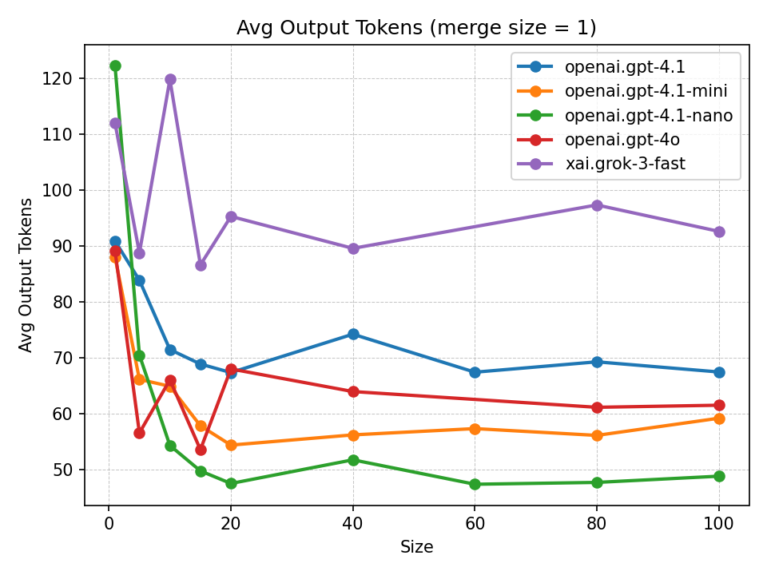
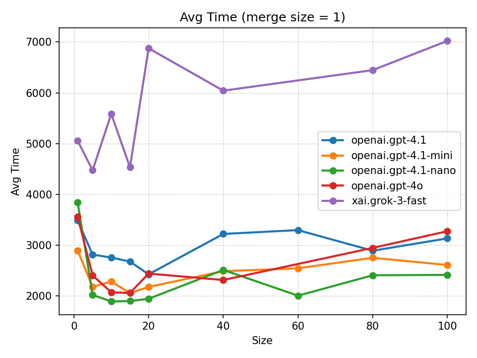

# LLM Tooling Benchmarks

This workspace evaluates how different language models handle autonomous tool execution. Each experiment samples a collection of tools, asks every configured LLM to run them, and records four primary signals: (1) how much it costs to trigger tool calls, (2) the probability that all required tools are invoked, (3) the wall-clock time needed to finish a prompt, and (4) the separate input/output token costs that contribute to the overall bill. The resulting CSV logs, JSON summaries, and charts make it easy to compare models on price-performance for tool-heavy workflows.

## Results

The `charts/merge1` directory currently holds the synthesized views for experiments with one tool call per prompt. Each figure maps the sampled set size on the X-axis 
and plots every model’s trend line on the Y-axis metric.

   

  Shows the percentage of expected tools that the assistant actually invoked. Flat, high lines indicate dependable tool execution regardless of prompt set size. System prompt was not set, so LLM had to instruct itself.
  
  

  Similar as graph above, this graph shows the percentage of expected tools that were called. However, system prompt was set. The setting System prompt play crutial role to set call tooling reliable. Here system prompt was set to "You are autonomous tool assistant that executes tools without requiring additional questions. If some additional information is requested, create them for demo purposes."

  

  Reflects prompt expansion cost. Models with lower curves consume fewer input tokens per tool invocation, which directly reduces upstream billing.

  

  Captures how verbose responses become. Taller curves imply chatty models (higher output token spend); flatter ones stay concise while still producing tool calls.

  
  Combines the token counts with `prices.py` to estimate dollars per prompt. This is the headline metric for comparing total spend across models.

  

  Plots cumulative wall-clock time per prompt. Lower lines mean faster completions and lower latency for downstream workflows.

## How to Run

The automation in `main.py` strings together every step—sampling tools, regenerating Java stubs, packaging the app, executing the experiments, averaging the data, and producing charts. Run it from the repository root:

1. **Pick experiment sizes** – Edit `EXPERIMENTS` near the top of `main.py`. Each tuple is `(entries, merge_size, repetitions)`. For example, `(60, 1, 2)` samples 60 single-tool prompts and repeats the run twice.
2. **Set prerequisites** – Ensure Java 21 + Maven are on your PATH (or set `JAVA_HOME`), and Python 3 has `matplotlib` installed.
3. **Launch the pipeline**  
   ```bash
   python3 main.py
   ```
   The script performs, for every tuple:
   - `python3 generate_tools_json.py --entries <entries> --merge-size <merge_size>`
   - `python3 generate_java_tools.py`
   - `mvn -q -DskipTests package`
   - `mvn -q exec:java -Dexec.mainClass=com.martinkoubek.llm_tooling_benchmarks.ExperimentLangchainTools`

   After all repetitions finish it calls:
   - `python3 average_statistics.py --data-dir data --summary-dir summary`
   - `python3 generate_merge1_plots.py`
   - `python3 generate_merge_compare_plots.py`

   Outputs land in `data/`, `summary/`, and `charts/` automatically.

## Conclusion

The dual tool-accuracy charts now make it clear how system-prompt scaffolding influences tool-calling experiments:
- **Prompt scaffolding and reliability** – Without the tooling instructions (`charts_no_system_prompt/charts/merge1/avg_tools_called.png`), the smaller models start to sag once the sampled catalog surpasses ~60 entries, while the larger models remain flat. Adding the explicit “You are autonomous…” system prompt (`charts/merge1/avg_tools_called.png`) brings every curve back toward 100 % success, leaving only the previously observed micro-dips (e.g., `gpt-4.1-mini` at 99.17 % for size 40 and `gpt-4.1-nano` at 98.13 %/99.0 % for sizes 80/100). The prompt is therefore the fastest lever for stabilizing cheap models without touching tools or data.
- **Pricing hierarchy** – `prices.py` lists per-million token rates of $0.10/$0.40 (`gpt-4.1-nano` input/output), $0.40/$1.60 (`gpt-4.1-mini`), $2/$8 (`gpt-4.1`), $2.5/$10 (`gpt-4o`), and $0.30/$0.50 (`grok-3-fast`). Multiplying those prices by the observed size-80 token counts yields per-request costs of roughly $0.00076 (nano), $0.00306 (mini), $0.0153 (gpt-4.1), $0.0190 (gpt-4o), and $0.00316 (grok-3-fast). The `avg_cost_usd` chart reflects the same order-of-magnitude spread.
- **Latency trends** – `avg_time` shows `gpt-4.1-nano` completing large batches fastest (≈2.0–2.5 s for sizes 60–100), followed by `gpt-4.1-mini` (~2.5–2.8 s) and `gpt-4.1`/`gpt-4o` (~2.9–3.3 s). `grok-3-fast` is consistently the slowest, taking ~6.4 s at size 80 and ~7.0 s at size 100 despite matching the others on tool-call accuracy.

In short, `gpt-4.1-nano` is the clear cost and latency winner but shows a small accuracy dip when the tool list grows past 80 prompts; `gpt-4.1-mini` costs slightly more yet keeps perfect recall except for the size-40 blip; `gpt-4.1` and `gpt-4o` deliver perfect reliability while costing an order of magnitude more; and `grok-3-fast` remains accurate but lags on speed while costing more than nano (and roughly tying mini). Pick the model whose curve best matches your tolerance for missed tools, latency, and budget, and layer in the system prompt whenever you need to harden tool execution on the lighter tiers.
