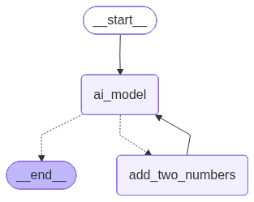

# Introduction
LangGraph is a low-level orchestration framework for building and managing
long-running, stateful agents. It provides durable execution, human-in-the-loop
capabilities, and comprehensive memory, making it well-suited for complex agent
workflows.

This repository demonstrates how to leverage LangGraph for practical use cases:
from simple tool-calling agents to a full AI recruiter assistant that
automates tasks such as CV scoring, meeting scheduling, and sending calendar
invitations.

## Files
### `ex01_tool_math_reactagent.py`
Basic math operations using LangGraph's tool creation. 
It defines a custom tool, `add_two_numbers`, and integrates it into an
agent powered by an AI model.

 

### `ex02_tool_math_custom_orchestration.py`: 
It extends the previous math example (ex01_tool_math_reactagent)
by routing tool execution through a dedicated **LangGraph node** instead
of relying on a **prebuilt ReAct agent**.

